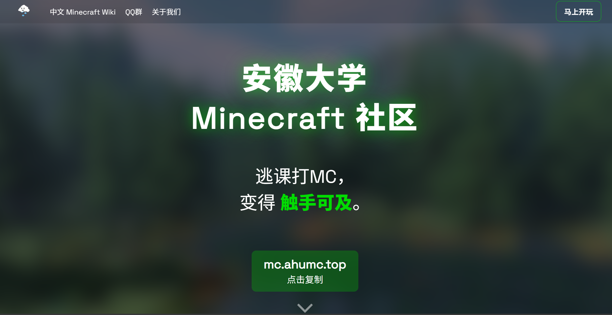

# 安徽大学 Minecraft 社区官网

安徽大学 Minecraft 社区的官方网站，用于宣传和展示我们的服务器。



本项目基于 [FQQD/MCServer-Web-Template](https://github.com/FQQD/MCServer-Web-Template) 进行定制开发。

**服务器地址：** `mc.ahumc.top`

## ✨ 特性

- 🎨 现代化设计风格
- 📱 完整的移动端适配
- 🖱️ 服务器地址一键复制功能
- 🎯 QQ 群二维码展示
- 👥 团队成员展示卡片
- 🎮 Java 和基岩版连接信息
- 🌐 响应式导航栏
- ✨ 流畅的悬停动画效果
- 💚 绿色主题发光效果

## 🎯 主要修改

相比原始模板，本项目进行了以下定制：

### 功能更新
- ✅ 将 Discord 集成改为 QQ 群展示
- ✅ 所有变量名从 `discord/dc` 改为 `qqgroup/qq`
- ✅ Logo 图片替换为大字号标题文本（带发光效果）
- ✅ 统一团队成员卡片样式

### 中文化
- ✅ 完整的中文界面
- ✅ 本地化的导航菜单
- ✅ 中文内容展示

### 样式优化
- ✅ 统一的成员卡片布局
- ✅ 不同角色的颜色区分（腐竹、管理员、工程师、建筑师、艺术家）
- ✅ 优化的响应式布局

## 📁 项目结构

```
MCServer-Web-Template-AHU/
├── index.html              # 主页面文件
├── media/
│   ├── style.css          # 样式表
│   ├── bg.png             # 背景图片
│   ├── qq.jpg             # QQ 群二维码
│   ├── favicon.png        # 网站图标
│   ├── logo_small.png     # 导航栏小图标
│   ├── downarrow.png      # 向下箭头
│   ├── kale.jpg           # 成员头像
│   ├── jemmy.jpg          # 成员头像
│   ├── lhm.jpg            # 成员头像
│   ├── jsbuaict.jpg       # 成员头像
│   ├── ming.jpg           # 成员头像
│   ├── yzhc.jpg           # 成员头像
│   └── ...
├── README.md              # 本文件
└── LICENSE                # MIT 许可证
```

## 🚀 快速开始

### 本地预览

1. 克隆仓库到本地：
```bash
git clone https://github.com/你的用户名/MCServer-Web-Template-AHU.git
cd MCServer-Web-Template-AHU
```

2. 直接在浏览器中打开 `index.html` 文件即可预览

### 自定义内容

#### 修改服务器信息
编辑 `index.html` 文件：
- **服务器地址**：在第 57 和 209 行修改 `mc.ahumc.top`
- **服务器版本**：在第 210 行修改版本号

#### 修改 QQ 群信息
- **QQ 群二维码**：替换 `media/qq.jpg` 文件
- **QQ 群链接**：在第 135 行修改加入链接

#### 修改团队成员
在 `index.html` 的第 144-195 行修改成员信息：
```html
<div class="main5_supporters_div">
  
  <div class="main5_supporters_description_div">
    <a class="main5_supporters_description_rank main5_supporters_description_rank_角色">角色名</a>
    <a class="main5_supporters_description_title" href="个人链接">成员名字</a>
    <a class="main5_supporters_description">- 职责1<br>- 职责2</a>
  </div>
</div>
```

#### 修改特色展示
在第 98-125 行修改服务器特色：
- 替换特色图片（`media/` 文件夹中）
- 修改特色标题和描述

#### 自定义样式
编辑 `media/style.css` 文件：
- **主题色**：修改第 4-6 行的 CSS 变量
```css
--accent1: #02db02;  /* 主色调 */
--accent2: #05b305;  /* 次色调 */
```

## 🎨 角色颜色配置

在 `media/style.css` 中定义了不同角色的颜色：
- **腐竹 (Owner)**：蓝色 `#3498db`
- **管理员 (Admin)**：红色 `#f82f2f`
- **其他角色 (Supporter)**：青色 `#00f8ff`

## 📦 部署

### GitHub Pages（推荐）
1. 在 GitHub 仓库设置中启用 Pages
2. 选择 `main` 分支作为源
3. 等待部署完成，访问提供的链接

### 其他托管服务
- **Neocities**：免费的静态网站托管
- **Vercel**：支持自动部署
- **自有服务器**：使用 Nginx 或 Caddy

## 🤝 贡献

欢迎提交 Issue 或 Pull Request！

## 📄 许可证

本项目基于 MIT 许可证开源。

### 致谢

- 原始模板：[@FQQD](https://github.com/FQQD) - [MCServer-Web-Template](https://github.com/FQQD/MCServer-Web-Template)
- 网页搭建与定制：Kaleid Scoper
- Logo 绘制：Kaleid Scoper

### 使用条款

根据原始模板的要求，页面底部的版权信息必须保留：
```
"由 FQQD 制作于 2023 - 由 Kaleid Scoper 编辑于 2025"
```

## 📞 联系我们

- **QQ 群**：575077308
- **服务器地址**：mc.ahumc.top
- **中文 Minecraft Wiki**：[zh.minecraft.wiki](https://zh.minecraft.wiki/)

---

**安徽大学 Minecraft 社区** - 逃课打 MC，变得触手可及。
